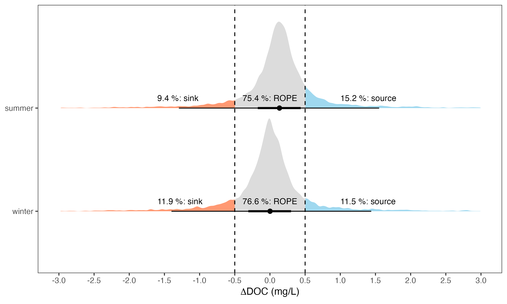
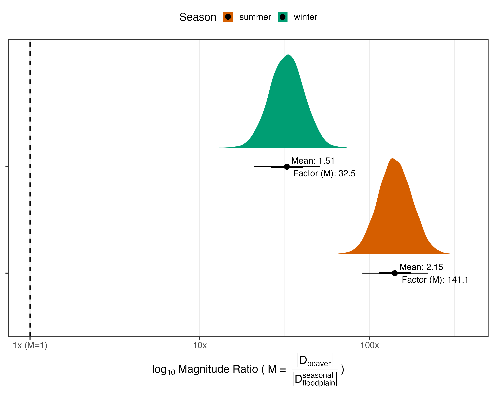

```{r setup}
#| include: false
library(tidyverse)
library(scales)
library(patchwork)
library(ggdist)
library(knitr)
library(here)

invisible(Sys.setlocale("LC_CTYPE", "en_US.UTF-8"))  # so non-ASCII prints correctly

set.seed(7)
SD_M  <- 0.2      # analytical error of one DOC concentration (mg/L)
NREP  <- 12000    # Monte Carlo replicates for measurement-error propagation

OK <- c(blue = "#0072B2", vermillion = "#D55E00", green = "#009E73",
        amber = "#E69F00", grey = "grey35")

dir.create(here("results", "figures", "plan"), recursive = TRUE, showWarnings = FALSE)
```

::: {.callout-tip appearance="simple"}
## What this document is for

This is a **decision document**, not the manuscript. It sets out, in one place:

1.  every variable we use, its unit, and the question it answers;
2.  how the derived variables are built (one diagram);
3.  which figure answers which research question, and whether it belongs in the **main text** or in **Appendix S1**;
4.  the two **new** analyses proposed after Josh's response-space note, computed here on the real data so we can judge them before committing.

Nothing in the Overleaf manuscript has been changed. Numbers below are computed live from `data/processed/`.
:::

# 1. The variables

Every quantity in the paper, with its unit and the question it exists to answer. Symbols are Latin letters; the subject of every statement is **beaver-engineering** (the physical modification beavers create), not the animal's current behaviour, because the upstream–downstream contrast measures the reach as a whole.

```{r variable-table}
#| echo: false
vars <- tribble(
  ~Symbol, ~Name, ~Definition, ~`Meaning (unit)`, ~`Question it answers`,

  "$\\text{DOC}_{up,s}$, $\\text{DOC}_{down,s}$", "measured concentrations", "—",
  "DOC concentration entering / leaving the beaver-engineered reach in season $s$ ($w$ = winter, $s$ = summer) **(mg L$^{-1}$)**",
  "What is the DOC concentration before and after the beaver-engineered reach in each season?",

  "$\\Delta\\text{DOC}_s$", "local response", "$\\text{DOC}_{down,s} - \\text{DOC}_{up,s}$",
  "the change in DOC that beaver-engineering produces in season $s$; positive = enrichment, negative = depletion **(mg L$^{-1}$)**",
  "Does beaver-engineering increase or decrease DOC concentrations, and by how much, in each season?",

  "$\\mathbf{S}$", "inherited **S**easonal signal", "$\\text{DOC}_{up,summer} - \\text{DOC}_{up,winter}$",
  "the seasonal DOC trajectory the upstream river corridor delivers to the reach; $S > 0$ seasonal enrichment, $S < 0$ seasonal depletion **(mg L$^{-1}$)**",
  "How does DOC change between winter and summer in the river *before* it reaches the beaver-engineered reach?",

  "$\\mathbf{B}$", "**B**eaver seasonal modification", "$\\Delta\\text{DOC}_{summer} - \\Delta\\text{DOC}_{winter}$",
  "how much beaver-engineering changes its own DOC response from winter to summer **(mg L$^{-1}$)**",
  "Does the effect of beaver-engineering on DOC differ between winter and summer, and in which direction?",

  "$T$", "downstream seasonal signal", "$S + B$ (exact identity)",
  "the seasonal DOC trajectory leaving the reach after beaver-engineering has modified it **(mg L$^{-1}$)**",
  "How does DOC change between winter and summer in the river *after* the beaver-engineered reach?",

  "$A_\\text{beaver}$, $A_\\text{floodplain}$", "areas", "mapped",
  "ponded footprint of the beaver-engineered reach; contributing catchment floodplain area generating $S$ **(km$^2$)**",
  "How large is the beaver-engineered footprint, and how large is the floodplain area that generates the inherited seasonal signal?",

  "$\\mathbf{G}$", "seasonal **G**ain", "$B / S$",
  "how beaver-engineering modifies the seasonal DOC signal inherited from upstream ($T = S(1 + G)$): $G > 0$ reinforces, $-1 < G < 0$ dampens, $G = -1$ cancels, $G < -1$ reverses the inherited trajectory, whether enrichment ($S > 0$) or depletion ($S < 0$) **(dimensionless)**",
  "Does beaver-engineering reinforce, dampen or reverse the seasonal DOC trajectory inherited from upstream?",

  "$\\mathbf{R_s}$", "**R**elative response, season $s$", "$\\Delta\\text{DOC}_s / \\lvert S \\rvert$",
  "how much DOC beaver-engineering adds ($R_s > 0$) or removes ($R_s < 0$) in season $s$, expressed as a fraction of the winter-to-summer swing of the incoming DOC; $R_s = 0.5$ means the change across the reach is half the seasonal swing **(dimensionless)**",
  "How much does beaver-engineering add or remove DOC in season $s$, relative to the seasonal DOC signal the reach inherits from upstream?",

  "$\\mathbf{F}$", "**F**ootprint contrast", "$A_\\text{floodplain} / A_\\text{beaver}$",
  "how much larger the floodplain area generating $S$ is than the beaver-engineered footprint **(dimensionless)**",
  "How small is the beaver-engineered footprint relative to the floodplain area that generates the inherited seasonal signal?",

  "$\\mathbf{L}$", "**L**everage", "$\\lvert G \\rvert \\cdot F$",
  "magnitude of beaver-engineering's modification of the inherited seasonal signal, per unit of engineered footprint **(dimensionless)**",
  "How strongly does beaver-engineering modify the inherited seasonal DOC signal relative to the small area it occupies?",

  "$D_{beaver,s}$", "area-normalised local response", "$\\Delta\\text{DOC}_s / A_\\text{beaver}$",
  "beaver-engineering's DOC change per unit of its footprint, season $s$ **(mg L$^{-1}$ km$^{-2}$)**",
  "How much DOC change does beaver-engineering produce per unit area of its footprint in season $s$?",

  "$D_\\text{floodplain}$", "area-normalised seasonal signal", "$S / A_\\text{floodplain}$",
  "the upstream seasonal DOC change per unit of floodplain area **(mg L$^{-1}$ km$^{-2}$)**",
  "How much seasonal DOC change does the floodplain generate per unit of its area?",

  "$\\mathbf{M}$", "amplification factor", "$\\lvert D_{beaver,s} \\rvert / \\lvert D_\\text{floodplain} \\rvert = \\lvert R_s \\rvert \\cdot F$",
  "how much larger, per unit area, beaver-engineering's DOC change in season $s$ is than the floodplain-scale seasonal DOC change **(dimensionless)**",
  "How many times larger, per unit area, is the DOC change produced by beaver-engineering than the seasonal DOC change generated by the floodplain?"
)
kable(vars)
```

::: {.callout-important}
## The identity that matters

$$T \;=\; S + B \;=\; S\,(1 + G)$$

The beaver-engineered reach is a **local operator acting on a signal it inherits** from the upstream corridor, not an intrinsically fixed DOC source or sink. This is the formal version of the "control point" framing already used in the manuscript.
:::

# 2. How the derived variables are built

{#fig-dag}

::: {.callout-note}
## Key message of @fig-dag

The **same causal mechanism** operates in winter and summer. Downstream DOC inherits the upstream DOC state and is modified by local hydrological and biological processes whose expression depends on season. S, B, T, G, F, L and M are **calculated outside the causal DAG** from the observed (or posterior) concentrations — they are contrasts, not extra causal nodes.

**Placement: Appendix S1** (companion to the hypothesised DAG, Fig. S1).
:::

# 3. Research questions and hypotheses

| \# | Research question | Hypothesis | Answered by |
|-----------------|-------------------|------------------|------------------|
| **Q1 Direction** | Does beaver-engineering consistently increase or decrease DOC concentrations downstream compared with upstream? | Beaver-engineering has **no consistent direction**: responses are variable and heavy-tailed, with a shift toward enrichment in summer when primary production is highest. | $\Delta$DOC$_s$, $B$ |
| **Q2 Drivers** | Which abiotic and biotic drivers set the direction of the DOC change? | Dams increase water residence time, which promotes primary producers and thereby DOC; high upstream DOC favours retention. | Structural causal model |
| **Q3 Magnitude** | Irrespective of direction, how large is the beaver-mediated DOC change per unit area relative to the seasonal floodplain-scale variation, and does it reinforce or oppose the inherited signal? | The change per unit area is orders of magnitude larger than the floodplain-scale seasonal signal, and beaver-engineering **modifies** (rather than merely adds to) the inherited seasonal trajectory. | $R_s$ (add/remove, relative to the inherited signal), $G$ (reinforce/dampen/reverse the seasonal trajectory), $F$ (spatial context); $M = \lvert R_s \rvert F$ only as a bridge |

# 4. Data used here

```{r load-data}
m <- read.csv(here("data", "processed", "m12.csv"))

w <- m |> filter(season == "winter") |>
  select(site, beaver_territory, up_w = DOC_input, dn_w = DOC_out,
         Afp = A_floodplain_km2, Abv = A_beaver_km2)
s <- m |> filter(season == "summer") |>
  select(site, beaver_territory, up_s = DOC_input, dn_s = DOC_out)

d <- inner_join(w, s, by = c("site", "beaver_territory")) |>
  mutate(
    dw      = dn_w - up_w,          # DOC_w : local response, winter
    ds      = dn_s - up_s,          # DOC_s : local response, summer
    S       = up_s - up_w,          # inherited seasonal signal
    B       = ds - dw,              # beaver seasonal modification
    Tt      = dn_s - dn_w,          # downstream seasonal signal (= S + B)
    G       = B / S,                # seasonal gain
    F       = Afp / Abv,            # footprint contrast
    ratio_s = abs(ds) / abs(S),     # concentration ratio, summer
    M_s     = ratio_s * F           # amplification factor, summer
  ) |>
  filter(is.finite(G), is.finite(F))

glue::glue("Paired reaches with complete seasonal and spatial data: {nrow(d)}")
```

# 5. Q1 — Direction

## Figure: seasonal posterior predictive distribution of ΔDOC

{#fig-q1}

::: {.callout-note}
## Key message of @fig-q1

Beaver-engineering does **not** change DOC in a consistent direction. The average change is negligible (+0.14 mg L⁻¹ summer, 0.00 mg L⁻¹ winter, both inside the ROPE), but individual responses are broad and heavy-tailed: for a single sampling the probability of a negligible change is about 76%, of enrichment 12–16%, of depletion 9–12%, with a **slight prevalence of enrichment in summer**.

**Placement: main text, Figure 1a.** *(unchanged from the current submission)*
:::

## Sentence to add to Q1: the seasonal switch

```{r q1-switch}
#| echo: true
switches <- d |> summarise(
  winter_pos = mean(dw > 0), summer_pos = mean(ds > 0),
  med_abs_w  = median(abs(dw)), med_abs_s = median(abs(ds)),
  dep_to_enr = sum(dw < 0 & ds > 0), enr_to_dep = sum(dw > 0 & ds < 0))
kable(switches |> mutate(across(c(winter_pos, summer_pos), ~sprintf("%.0f%%", 100*.x)),
                         across(starts_with("med"), ~round(.x, 3))),
      col.names = c("winter enriching", "summer enriching",
                    "median $\\lvert \\Delta$DOC$\\rvert$ winter", "median $\\lvert \\Delta$DOC$\\rvert$ summer",
                    "depletion → enrichment", "enrichment → depletion"))
```

::: {.callout-note}
## Key message

Winter responses are almost evenly split between enrichment and depletion and are small; summer responses are larger and more often positive, and roughly twice as many reaches switch from winter depletion to summer enrichment as the reverse. This is a **one-sentence addition to Q1**, no new figure.
:::

# 6. Q2 — Drivers

{#fig-q2}

::: {.callout-note}
## Key message of @fig-q2

Direction is set by the **external context** of the pond. Upstream DOC has the largest total effect (−0.10), followed by solar radiation acting through primary producers (+0.04); dam number (+0.003) and dam height (+0.001) act only weakly, through water residence time. Beaver-engineering creates the conditions; the inputs decide the sign.

**Placement: main text, Figure 1b.** *(unchanged)* Supporting: total effects (Fig. S7), priors/residuals/checks (Figs. S2–S5), alternative connectivity SCM (Figs. S8–S9).
:::

# 7. Q3 — Magnitude and modification

This is where the two new analyses go.

## 7.0 NEW: the relative response R_s — how much beaver-engineering adds or removes, relative to the inherited seasonal signal

$R_s = \Delta\text{DOC}_s / \lvert S \rvert$ keeps the sign of the beaver effect (add or remove) and expresses its size as a fraction of the winter-to-summer swing of the incoming DOC. It is estimated from the **latent** concentrations of a hierarchical measurement-error model (one model per measured concentration, log scale, 0.2 mg L$^{-1}$ error), so the ratio never divides by a raw value.

```{r latent-R}
#| results: hide
# Latent concentrations are fitted by notebook/latent_concentrations_fit.R and saved in results/latent_R.rds (thinned copy latent_R_thin.rds is tracked)
LR <- readRDS(here("results", "latent_R_thin.rds"))   # 1000 thinned draws; full draws in latent_R.rds (git-ignored)
R_s <- LR$R_s; R_w <- LR$R_w; S_lat <- LR$S
medR <- function(R, keep = rep(TRUE, ncol(R))) apply(R[, keep, drop = FALSE], 1, median)
absS <- apply(abs(S_lat), 2, median)
qf <- function(x) sprintf("%.2f [%.2f, %.2f]", median(x), quantile(x, .025), quantile(x, .975))
R_tab <- tibble(
  Quantity = c("Median $R_{summer}$ across reaches", "Median $R_{winter}$ across reaches",
               "$R_{summer} - R_{winter}$", "Median $\\lvert R_{summer} \\rvert$ (unsigned, = the 'half')",
               "Median $R_{summer}$, excluding the 10% smallest $\\lvert S \\rvert$",
               "Median $R_{summer}$, excluding the 20% smallest $\\lvert S \\rvert$"),
  `Posterior median [95% CrI]` = c(qf(medR(R_s)), qf(medR(R_w)), qf(medR(R_s) - medR(R_w)), qf(apply(abs(R_s), 1, median)),
               qf(medR(R_s, absS > quantile(absS, .1))), qf(medR(R_s, absS > quantile(absS, .2)))),
  `P(> 0)` = c(mean(medR(R_s) > 0), mean(medR(R_w) > 0), mean(medR(R_s) - medR(R_w) > 0), NA,
               mean(medR(R_s, absS > quantile(absS, .1)) > 0), mean(medR(R_s, absS > quantile(absS, .2)) > 0)))
```

```{r R-table}
#| echo: false
kable(R_tab |> mutate(`P(> 0)` = ifelse(is.na(`P(> 0)`), "", sprintf("%.3f", `P(> 0)`))))
```

```{r fig-R}
#| fig-height: 5
pm <- tibble(reach = seq_len(ncol(R_s)),
             summer = apply(R_s, 2, median), winter = apply(R_w, 2, median),
             p_summer = colMeans(R_s > 0)) |>
  pivot_longer(c(summer, winter), names_to = "season", values_to = "R")
pop <- tibble(season = c("summer", "winter"), m = c(median(medR(R_s)), median(medR(R_w))),
              lo = c(quantile(medR(R_s), .025), quantile(medR(R_w), .025)),
              hi = c(quantile(medR(R_s), .975), quantile(medR(R_w), .975)))
psl <- pseudo_log_trans(sigma = 0.1, base = 10)
p_R <- ggplot(pm, aes(x = R, y = season, fill = season)) +
  geom_vline(xintercept = 0, colour = "grey50") +
  stat_halfeye(.width = c(.5, .9), alpha = .75, point_interval = "median_qi", show.legend = FALSE) +
  geom_pointrange(data = pop, aes(x = m, xmin = lo, xmax = hi, y = season), inherit.aes = FALSE,
                  colour = "black", size = .6, position = position_nudge(y = -.22)) +
  scale_fill_manual(values = c(summer = OK[["vermillion"]], winter = OK[["green"]])) +
  scale_x_continuous(trans = psl, breaks = c(-10, -1, -0.5, 0, 0.5, 1, 10)) +
  labs(x = expression("Relative response  "*R[s]*" = "*Delta*DOC[s]*" / |S|   (dimensionless, pseudo-log axis)"), y = NULL,
       subtitle = "Coloured: distribution of the per-reach posterior medians across the 158 reaches.\nBlack: posterior median and 95% CrI of the across-reach median.") +
  theme_bw(base_size = 12) + theme(panel.grid.minor = element_blank(), plot.subtitle = element_text(size = 9, colour = "grey35"))
ggsave(here("results", "figures", "plan", "fig_R.png"), p_R, width = 9, height = 5, dpi = 300)
p_R
```

::: {.callout-important}
## Key message of @fig-R

**In summer, beaver-engineering adds DOC equal to about one fifth of the seasonal swing of the incoming DOC; in winter it adds nothing.** The across-reach median of $R_{summer}$ is `r sprintf("%.2f", median(medR(R_s)))` (95% CrI `r sprintf("%.2f to %.2f", quantile(medR(R_s),.025), quantile(medR(R_s),.975))`, P(> 0) = `r sprintf("%.3f", mean(medR(R_s)>0))`) against `r sprintf("%.2f", median(medR(R_w)))` for $R_{winter}$. The positive median hides substantial two-sided variation: `r sum(colMeans(R_s>0)>0.9)` reaches have P($R_{summer}$ > 0) > 0.9 (beaver-engineering adds DOC) and `r sum(colMeans(R_s>0)<0.1)` have P($R_{summer}$ < 0) > 0.9 (it removes DOC). The unsigned median $\lvert R_{summer} \rvert$ = `r sprintf("%.2f", median(apply(abs(R_s),1,median)))` is the "half the seasonal signal" that M contains. Excluding the reaches with the smallest $\lvert S \rvert$ lowers the median but not the conclusion.

This is the quantity that answers "how much does beaver-engineering add or remove relative to the floodplain seasonal signal?" in concentration units, with its sign. **Placement: main text, as the primary Q3 result (Figure 2a), with F stated once as context and M shown only as $\lvert R_s \rvert \times F$ beside its decomposition.**
:::

## 7.1 NEW: what the amplification factor M is actually made of

```{r m-decomposition}
comp <- bind_rows(
  tibble(q = "ratio", v = d$ratio_s),
  tibble(q = "F",     v = d$F),
  tibble(q = "M",     v = d$M_s)) |>
  filter(v > 0) |>
  mutate(q = factor(q, levels = rev(c("ratio", "F", "M"))))

med <- comp |> group_by(q) |> summarise(m = median(v), .groups = "drop")

lab_expr <- c(
  ratio = "atop('Concentration ratio', '|'*Delta*'DOC'[summer]*'| / |S|')",
  F     = "atop('Footprint contrast', 'F = '*A[floodplain]/A[beaver])",
  M     = "atop('Amplification factor', 'M = ratio '%*%' F')")

p_dec <- ggplot(comp, aes(v, q)) +
  geom_vline(xintercept = 1, linetype = "dashed", colour = "grey50") +
  stat_halfeye(aes(fill = q), .width = c(.5, .95), point_interval = "median_qi",
               alpha = .85, show.legend = FALSE) +
  geom_text(data = med, aes(x = m, label = ifelse(m < 10, sprintf("median %.2f", m),
                                                  sprintf("median %.0f", m))),
            vjust = -1.9, size = 3.6, colour = "grey20") +
  scale_fill_manual(values = c(ratio = OK[["blue"]], F = OK[["amber"]], M = OK[["green"]])) +
  scale_y_discrete(labels = function(x) parse(text = lab_expr[x])) +
  scale_x_log10(labels = label_log(), breaks = 10^(-2:5)) +
  labs(x = "Value (dimensionless, log scale)", y = NULL) +
  theme_bw(base_size = 12) +
  theme(panel.grid.minor = element_blank(),
        axis.text.y = element_text(lineheight = 1.05))

ggsave(here("results", "figures", "plan", "fig_M_decomposition.png"),
       p_dec, width = 9, height = 4.6, dpi = 300)
p_dec
```

```{r m-numbers}
#| echo: false
kable(tibble(
  Quantity = c("Concentration ratio $\\lvert \\Delta\\text{DOC}_{summer} \\rvert / \\lvert S \\rvert$", "Footprint contrast $F$",
               "Amplification factor $M$ (summer)", "Beaver footprint as % of floodplain"),
  Median = c(sprintf("%.2f", median(d$ratio_s)), sprintf("%.0f", median(d$F)),
             sprintf("%.0f", median(d$M_s)), sprintf("%.2f%%", 100*median(1/d$F)))))
```

::: {.callout-important}
## Key message of the decomposition

**M is the product of a modest concentration ratio and a very large footprint contrast.** In a typical stream, beaver-engineering changes DOC across the reach ($\lvert \Delta\text{DOC}_{summer} \rvert$) by about 0.57 times the seasonal swing of the incoming DOC ($\lvert S \rvert$) — this is $\lvert R_{summer} \rvert$ — while the engineered footprint $A_\text{beaver}$ is only 1/256 (about **0.4%**) of the floodplain area $A_\text{floodplain}$ that generates $S$. Since $M = \lvert R_s \rvert \times F \approx 0.57 \times 256$, the "≈140 times" comes mainly from the area ratio $F$, not from the size of the concentration change.

Reporting the two factors separately is the honest version of the current Q3 claim, it is far harder to attack, and it answers Reviewer 1's question about what "floodplain-scale" means. A reviewer who does this arithmetic unaided will otherwise conclude the headline oversells the biogeochemistry.

**Placement: main text, Figure 2b, beside $R_s$; the model-based seasonal M posterior moves to Appendix S1 or is dropped.**
:::

{#fig-M}

::: {.callout-note}
## Key message of @fig-M

Per unit area, the DOC change produced by beaver-engineering is **141 times** the floodplain-scale seasonal change in summer and **33 times** in winter; both 95% intervals lie entirely above the equivalence line.

**Placement: main text, Figure 2b.** *(unchanged, but now read together with the decomposition)*
:::

## 7.2 NEW: does beaver-engineering reinforce, dampen or reverse the inherited signal?

The measurement error of each concentration (0.2 mg L⁻¹) must be carried into S and B, otherwise the state counts are read off point values that the data do not support. We do this with a **Bayesian hierarchical measurement-error model**, in the same style as the rest of the paper, not with a null-hypothesis test.

::: {.callout-note appearance="simple"}
## Why S and T, and not S and B

S and B share the two upstream measurements, so their errors are correlated (ρ = −0.71) and cannot be modelled independently. The two contrasts that use **disjoint** samples are

$$S = \text{DOC}_{up,summer} - \text{DOC}_{up,winter} \qquad T = \text{DOC}_{down,summer} - \text{DOC}_{down,winter}$$

Their errors are independent, each with SD $\sqrt2 \times 0.2 = 0.283$ mg L⁻¹. We estimate the latent true S and T per reach, then derive $B = T - S$ and $G = B/S$ from the posterior, which reproduces the correct error correlation automatically.
:::

```{r latent-model}
#| results: hide
library(brms)
dd <- d |> mutate(S_obs = S, T_obs = Tt, se_d = sqrt(2) * SD_M, reach = factor(row_number()))

pri <- c(prior(normal(0, 2), class = "Intercept"),
         prior(student_t(3, 0, 2.5), class = "sd"))

fit_latent <- function(f, file)
  brm(f, data = dd, prior = pri, chains = 4, cores = 4, iter = 3000, warmup = 1000,
      seed = 7, backend = "cmdstanr", control = list(adapt_delta = 0.95),
      file = here("results", "models_fit", file), refresh = 0)

fS <- fit_latent(bf(S_obs | se(se_d, sigma = FALSE) ~ 1 + (1 | reach)), "latent_S")
fT <- fit_latent(bf(T_obs | se(se_d, sigma = FALSE) ~ 1 + (1 | reach)), "latent_T")

latent <- function(f) { x <- as_draws_df(f)
  as.matrix(x[, grep("^r_reach\\[", names(x))]) + x$b_Intercept }
Slat <- latent(fS); Tlat <- latent(fT); Blat <- Tlat - Slat
```

```{r states-bayes}
STATES <- c("Amplifies enrichment", "Dampens enrichment", "Reverses enrichment to depletion",
            "Amplifies depletion",  "Dampens depletion",  "Reverses depletion to enrichment")

classify_i <- function(S, B) { G <- B / S
  ifelse(G > 0, ifelse(S > 0, 1, 4), ifelse(G > -1, ifelse(S > 0, 2, 5), ifelse(S > 0, 3, 6))) }

st   <- classify_i(Slat, Blat)                          # posterior draws x reaches
cnt  <- t(apply(st, 1, \(r) tabulate(r, 6)))            # posterior draws x 6 counts

tab <- tibble(
  state     = factor(STATES, levels = STATES),
  post_mean = round(colMeans(cnt), 1),
  lo        = apply(cnt, 2, quantile, .025),
  hi        = apply(cnt, 2, quantile, .975),
  point     = as.numeric(tabulate(classify_i(dd$S_obs, dd$T_obs - dd$S_obs), 6)))
kable(tab, col.names = c("Response state", "Posterior mean count", "2.5%", "97.5%",
                         "Count from point values (ignoring error)"))
```

```{r bayes-contrasts}
#| echo: false
p_state <- apply(st, 2, \(v) max(tabulate(v, 6)) / length(v))   # per-reach classification confidence
d$p_state  <- p_state
d$B_strong <- colMeans(abs(Blat) > 0.5) > 0.9                    # ROPE on B, as elsewhere in the paper

ctr <- tibble(
  Contrast = c("Reverses depletion $\\to$ enrichment $-$ reverses enrichment $\\to$ depletion",
               "Amplifies enrichment $-$ dampens enrichment",
               "Number of reaches with $B > 0$ (out of 158)",
               "Median $B$ across reaches (mg L$^{-1}$)"),
  Posterior = c(mean(cnt[,6] - cnt[,3]), mean(cnt[,1] - cnt[,2]),
                mean(rowSums(Blat > 0)), mean(apply(Blat, 1, median))),
  lo = c(quantile(cnt[,6]-cnt[,3], .025), quantile(cnt[,1]-cnt[,2], .025),
         quantile(rowSums(Blat > 0), .025), quantile(apply(Blat, 1, median), .025)),
  hi = c(quantile(cnt[,6]-cnt[,3], .975), quantile(cnt[,1]-cnt[,2], .975),
         quantile(rowSums(Blat > 0), .975), quantile(apply(Blat, 1, median), .975)),
  `P(> 0)` = c(mean(cnt[,6] - cnt[,3] > 0), mean(cnt[,1] - cnt[,2] > 0),
               mean(rowSums(Blat > 0) > 79), mean(apply(Blat, 1, median) > 0)))
kable(ctr |> mutate(across(where(is.numeric), ~round(.x, 2))),
      caption = "Posterior contrasts. For the count of reaches with B > 0 the probability shown is P(more than half).")

glue::glue(
"Reaches whose six-state label carries posterior probability above 0.9: {sum(p_state>0.9)} of {nrow(d)} ({round(100*mean(p_state>0.9))}%)
Reaches with P(|B| above 0.5 mg/L) above 0.9, i.e. a practically relevant seasonal modification: {sum(d$B_strong)} of {nrow(d)}
Between-reach SD of the true inherited signal S: {round(mean(as_draws_df(fS)$sd_reach__Intercept),2)} mg/L (measurement SD 0.283), so shrinkage is small")
```

```{r fig-response-space}
#| fig-height: 10.5
d <- d |> mutate(lab = ifelse(ds > 0, "Summer: DOC enrichment", "Summer: DOC depletion"),
                 S_pm = apply(Slat, 2, median), B_pm = apply(Blat, 2, median))
psl <- pseudo_log_trans(sigma = 0.1, base = 10)

ann <- tibble(
  x = c(20, 20, -20, -20), y = c(20, -20, 20, -20),
  hj = c(1, 1, 0, 0),
  lab = c("Amplifies\nseasonal enrichment", "Dampens / reverses\nseasonal enrichment",
          "Dampens / reverses\nseasonal depletion", "Amplifies\nseasonal depletion"))

pa <- ggplot(d, aes(S_pm, B_pm)) +
  annotate("segment", x = -40, xend = 40, y = 40, yend = -40,
           linetype = "dashed", colour = "grey45", linewidth = .5) +
  geom_hline(yintercept = 0, colour = "grey70", linewidth = .4) +
  geom_vline(xintercept = 0, colour = "grey70", linewidth = .4) +
  geom_point(aes(colour = lab, shape = lab, alpha = B_strong), size = 2.1, stroke = .9) +
  geom_text(data = ann, aes(x, y, label = lab, hjust = hj), size = 3.1,
            colour = "grey30", lineheight = .95, inherit.aes = FALSE) +
  scale_colour_manual(values = c("Summer: DOC enrichment" = OK[["blue"]],
                                 "Summer: DOC depletion"  = OK[["vermillion"]]), name = NULL) +
  scale_shape_manual(values = c("Summer: DOC enrichment" = 24,
                                "Summer: DOC depletion"  = 25), name = NULL) +
  scale_alpha_manual(values = c(`FALSE` = .25, `TRUE` = 1), guide = "none") +
  scale_x_continuous(trans = psl, breaks = c(-10,-1,0,1,10), limits = c(-40, 40)) +
  scale_y_continuous(trans = psl, breaks = c(-10,-1,0,1,10), limits = c(-40, 40)) +
  labs(x = expression("Inherited seasonal signal   S   (mg "*L^-1*")"),
       y = expression("Beaver seasonal modification   B   (mg "*L^-1*")"),
       subtitle = "Posterior medians of the latent (measurement-error corrected) contrasts\nDashed diagonal: B = -S, exact cancellation.  Solid symbols: P(|B| > 0.5 mg/L) > 0.9") +
  theme_bw(base_size = 12) +
  theme(panel.grid.minor = element_blank(), legend.position = "top",
        plot.subtitle = element_text(size = 9, colour = "grey35"))

tb <- tab |> mutate(state = fct_rev(state),
                    side = ifelse(state %in% STATES[c(1, 6)], "pushes toward summer enrichment",
                                  ifelse(state %in% STATES[c(3, 4)], "pushes toward summer depletion",
                                         "dampens the inherited signal")))
pb <- ggplot(tb, aes(y = state)) +
  geom_pointrange(aes(x = post_mean, xmin = lo, xmax = hi, colour = side), size = .55) +
  scale_colour_manual(values = c("pushes toward summer enrichment" = OK[["blue"]],
                                 "pushes toward summer depletion"  = OK[["vermillion"]],
                                 "dampens the inherited signal"    = "grey40"), name = NULL) +
  labs(x = "Posterior number of reaches (mean and 95% credible interval)", y = NULL,
       subtitle = "Counts derived from the latent S and B of the hierarchical measurement-error model,\nso the classification uncertainty is propagated rather than ignored") +
  guides(colour = guide_legend(nrow = 2)) +
  theme_bw(base_size = 12) +
  theme(panel.grid.minor = element_blank(), panel.grid.major.y = element_blank(),
        legend.position = "top", plot.subtitle = element_text(size = 9, colour = "grey35"))

fig_rs <- pa / pb + plot_layout(heights = c(1.45, 1)) + plot_annotation(tag_levels = "a")
ggsave(here("results", "figures", "plan", "fig_response_space.png"),
       fig_rs, width = 9, height = 10.5, dpi = 300)
fig_rs
```

::: {.callout-important}
## Key message of the response space

**(a)** Beaver-engineered reaches occupy all six response states: they reinforce, dampen and occasionally reverse the seasonal DOC trajectory they inherit. This is the visual proof that the reach is an **operator on an incoming signal**, not a fixed source or sink.

**(b)** The state counts come from the latent S and B of the measurement-error model, so their uncertainty is carried rather than ignored. The asymmetry is unambiguous and all of it points one way:

-   reversals of depletion into enrichment exceed the opposite reversals by `r sprintf("%.0f", ctr$Posterior[1])` reaches (95% CrI `r sprintf("%.0f to %.0f", ctr$lo[1], ctr$hi[1])`), P(> 0) = `r sprintf("%.3f", ctr$"P(> 0)"[1])`;
-   amplification of enrichment exceeds dampening of enrichment by `r sprintf("%.0f", ctr$Posterior[2])` reaches (`r sprintf("%.0f to %.0f", ctr$lo[2], ctr$hi[2])`), P(> 0) = `r sprintf("%.3f", ctr$"P(> 0)"[2])`;
-   `r sprintf("%.0f", ctr$Posterior[3])` of 158 reaches (`r sprintf("%.0f to %.0f", ctr$lo[3], ctr$hi[3])`) have B > 0, and the median seasonal modification is `r sprintf("%.2f", ctr$Posterior[4])` mg L⁻¹ (`r sprintf("%.2f to %.2f", ctr$lo[4], ctr$hi[4])`), P(> 0) = `r sprintf("%.3f", ctr$"P(> 0)"[4])`.

**Beaver-engineering systematically pushes the inherited seasonal trajectory toward summer enrichment.** This is the same signal as Q1 (+0.14 mg L⁻¹ in summer) and the primary-producer pathway of Q2, now expressed as an operation on the incoming signal rather than as an average.

The honest caveat stays at the level of the individual reach: only `r sum(d$p_state > 0.9)` of `r nrow(d)` reaches carry their six-state label with posterior probability above 0.9. **The population-level asymmetry is solid; per-reach labels are not**, so the six states should be reported as posterior counts with intervals, never as a tally of point classifications.

**Placement: panel (a) main text as Figure 3, panel (b) Appendix S1** — or both in Appendix S1 if we want to keep the main text to three figures.
:::

# 8. Figure inventory

```{r inventory}
#| echo: false
inv <- tribble(
  ~Figure, ~Content, ~`Answers`, ~Placement, ~Status,
  "Fig. 1a", "Seasonal posterior predictive of $\\Delta$DOC", "Q1 Direction", "Main text", "existing",
  "Fig. 1b", "SCM with estimated paths", "Q2 Drivers", "Main text", "existing",
  "Fig. 2a", "Relative response $R_s$ by season", "Q3 Magnitude and sign", "Main text", "**new**",
  "Fig. 2b", "Decomposition of $M = \\lvert R_s \\rvert \\times F$", "Q3 Magnitude", "Main text", "**new**",
  "Fig. S12", "Model-based $M$ by season", "Q3 Magnitude", "Appendix S1 (or drop)", "existing",
  "Fig. 3",  "Response space $S$–$B$", "Q3 Modification (G)", "Main text (or S1)", "**new**",
  "Fig. 4",  "Map, sampling design and $M$ schematic", "Methods", "Main text", "existing",
  "Fig. S1", "Hypothesised DAG with numbered paths", "Q2", "Appendix S1", "existing",
  "Fig. S2–S5", "Priors, residuals, posterior checks, posterior parameters", "Q2", "Appendix S1", "existing",
  "Fig. S6", "Stream-level classification of $\\Delta$DOC", "Q1", "Appendix S1", "existing",
  "Fig. S7", "Total effects of the drivers", "Q2", "Appendix S1", "existing",
  "Fig. S8–S9", "Alternative SCM with lateral connectivity", "Q2", "Appendix S1", "existing",
  "Fig. S10", "Variable-derivation DAG (this document, §2)", "all", "Appendix S1", "**new**",
  "Fig. S11", "Posterior state counts (measurement-error model)", "Q3", "Appendix S1", "**new**",
  "Table S1", "Tested hypotheses per causal path", "Q2", "Appendix S1", "existing")
kable(inv)
```

# 9. What I recommend **not** doing

::: {.callout-warning}
## Four things to leave out

1.  **L (leverage) as a headline index.** It is numerically almost the same as M (`r sprintf("median L = %.0f vs median M = %.0f", median(abs(d$G)*d$F), median(d$M_s))`), and it has a blind spot M does not: a reach that enriches DOC equally in both seasons has B = 0, hence G = 0 and L = 0, i.e. "no leverage" despite a strong constant effect. Mention it in Appendix S1 at most.

2.  **The six-state counts as raw numbers.** See §7.2 — noise alone reproduces four of the six.

3.  **Rebuilding the SCM before submission.** Josh's proposal (season-specific downstream DOC as the target, everything derived from posteriors) is correct in principle, and the Q1 model already implements it for direction. But the full version re-specifies an eight-equation multivariate model, forces a redesign of every prior (upstream DOC changes from a standardized driver near −0.10 to an inheritance coefficient near +1), and changes Figure 1b, Table S1 and six supplementary figures simultaneously. That is a two-week job, treated in the companion document `scm_rebuild.qmd`.

4.  **Four new figures.** Two are enough; the rest belong in the supplement.
:::

# 10. Reproducibility

```{r session}
#| echo: false
cat("Data:   data/processed/m12.csv (paired seasons, areas)\n")
cat("Output: results/figures/plan/fig_M_decomposition.png, fig_response_space.png\n\n")
sessionInfo()$R.version$version.string
```
