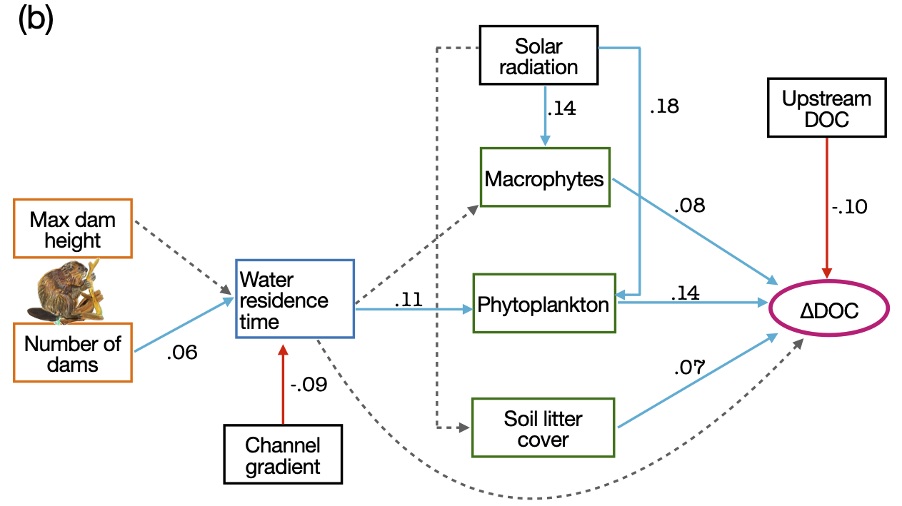

```{r setup}
#| include: false
library(tidyverse); library(scales); library(patchwork); library(ggdist); library(knitr); library(here)
invisible(Sys.setlocale("LC_CTYPE", "en_US.UTF-8"))
set.seed(7)
# One colour per meaning, used in every figure: DOC added (source) = skyblue, DOC removed (sink) = coral,
# negligible / undetermined = lightgrey. Never used for anything else.
PAL <- c(add = "skyblue", remove = "coral", none = "lightgrey")
dir.create(here("results", "figures", "plan"), recursive = TRUE, showWarnings = FALSE)
```

::: {.callout-tip appearance="simple"}
## Purpose

This document fixes the story of the manuscript: three research questions, the variables that answer them, and the figures that go into the main text and into Appendix S1. Everything not listed here is left out. Figure numbers in this document (Figure 1, 2, …) are its own; the manuscript figure each one becomes is written in bold above it.
:::

# 1. The variables

The subject of every effect statement is **beaver-engineering**, the physical modification beavers create, because the upstream–downstream contrast measures the whole beaver-engineered stream. The unit of analysis is the stream.

```{r variable-table}
#| echo: false
kable(tribble(
  ~Symbol, ~Name, ~Definition, ~`Meaning (unit)`, ~`Question it answers`,
  "$\\text{DOC}_{up,s}$, $\\text{DOC}_{down,s}$", "upstream DOC, downstream DOC", "measured",
  "DOC concentration entering / leaving the beaver-engineered stream in season $s$ ($w$ = winter, $s$ = summer) **(mg L$^{-1}$)**",
  "What is the DOC concentration before and after the beaver-engineered stream in each season?",
  "$\\Delta\\text{DOC}_s$", "local response", "$\\text{DOC}_{down,s} - \\text{DOC}_{up,s}$",
  "the change in DOC that beaver-engineering produces in season $s$; positive = enrichment, negative = depletion **(mg L$^{-1}$)**",
  "Does beaver-engineering increase or decrease DOC, and by how much, in each season?",
  "$S$", "inherited seasonal contrast", "$\\text{DOC}_{up,summer} - \\text{DOC}_{up,winter}$",
  "the winter-to-summer change of upstream DOC, i.e. what the upstream river corridor delivers to the stream **(mg L$^{-1}$)**",
  "How much does DOC change between winter and summer in the river before it reaches the beaver-engineered stream?",
  "$R_s$", "relative response", "$\\Delta\\text{DOC}_s / \\lvert S \\rvert$",
  "how much DOC beaver-engineering adds ($R_s > 0$) or removes ($R_s < 0$) in season $s$, as a fraction of the inherited seasonal contrast **(dimensionless)**",
  "How much does beaver-engineering add or remove DOC, relative to the inherited seasonal contrast?",
  "$B$", "beaver seasonal modification", "$\\Delta\\text{DOC}_{summer} - \\Delta\\text{DOC}_{winter}$",
  "how much beaver-engineering changes the winter-to-summer DOC contrast **(mg L$^{-1}$)**",
  "Does beaver-engineering change the seasonal DOC contrast, beyond its effect within each season?",
  "$G$", "seasonal gain", "$B / S$",
  "$G > 0$: beaver-engineering **reinforces** the inherited seasonal contrast; $-1 < G < 0$: **dampens** it; $G < -1$: **reverses** it **(dimensionless)**",
  "Does beaver-engineering reinforce, dampen or reverse the inherited seasonal contrast?",
  "$A_\\text{beaver}$, $A_\\text{floodplain}$", "areas", "mapped",
  "ponded footprint of the beaver-engineered stream; contributing catchment floodplain area **(km$^2$)**",
  "How large is the beaver-engineered footprint, and how large is the floodplain that generates $S$?",
  "$F$", "footprint contrast", "$A_\\text{floodplain} / A_\\text{beaver}$",
  "how much larger the floodplain area is than the beaver-engineered footprint **(dimensionless)**",
  "How small is the beaver-engineered footprint relative to the floodplain that generates $S$?"))
```

**Manuscript placement: Appendix S1 (Figure S10).**

{#fig-dag}

# 2. Research questions and hypotheses

**Q1 — Direction.** *Does beaver-engineering consistently increase or decrease DOC downstream compared with upstream?*
Hypothesis: if a stream is impounded by beaver dams, then the local response $\Delta\text{DOC}_s$ will not have a consistent sign across streams, because impoundment simultaneously starts DOC-producing processes — exudation and senescence of phytoplankton and macrophytes, leaching of litter and inundated soils (Søndergaard et al. 1985; Sell & Overbeck 1992; Aitkenhead et al. 1999) — and DOC-removing processes — microbial mineralization, photodegradation and sedimentation during the longer residence time (Johnston 2017; Nummi et al. 2018) — whose balance depends on the stream; syntheses accordingly report enrichment, no change and depletion (Larsen et al. 2021; Grudzinski et al. 2022). We further expect the balance to tilt toward enrichment in summer, when production exceeds removal (Mulholland & Hill 1997).

**Q2 — Drivers.** *Which abiotic and biotic drivers set the direction of the local response?*
Hypothesis: if the number of dams increases, then water residence time increases because each dam impounds water and slows flow (Westbrook et al. 2006; Majerova et al. 2015); if water residence time and solar radiation increase, then phytoplankton and macrophyte abundance increase because nutrients are retained and light is available for photosynthesis (Reynolds 2006; Finger et al. 2007; Feuchtmayr et al. 2009); if primary producer abundance and soil litter cover increase, then $\Delta\text{DOC}_s$ increases because exudation, senescence and litter leaching release DOC (Reitsema et al. 2018; Gessner et al. 1999); if upstream DOC increases, then $\Delta\text{DOC}_s$ decreases because a larger incoming load is proportionally retained or mineralized within the pond (Larson et al. 2007; Wohl 2013). The thirteen path-specific hypotheses are in Appendix S1, Table S1.

**Q3 — Magnitude and seasonal modification.** *How much does beaver-engineering add or remove DOC relative to the inherited seasonal contrast, and does it reinforce, dampen or reverse that contrast?*
Hypothesis, magnitude: if the season is summer, then the relative response $R_{summer}$ will be positive and a substantial fraction of the inherited seasonal contrast, because higher light and temperature raise autochthonous DOC production inside the pond independently of the upstream corridor (Mulholland & Hill 1997; Battin et al. 2023); if the season is winter, then $R_{winter}$ will be close to zero because primary production is minimal.
Hypothesis, modification: if the summer response exceeds the winter response ($B > 0$ where $S > 0$), then the seasonal gain $G$ will be positive and beaver-engineering will reinforce the inherited seasonal contrast; because the balance of DOC-producing and DOC-removing processes is stream-specific (Q1), we expect $G$ to be heterogeneous across streams, with reinforcement, dampening and reversal all present.
Because $A_\text{beaver}$ is a very small part of $A_\text{floodplain}$ (footprint contrast $F \gg 1$), both responses arise on a footprint far smaller than the corridor that generates $S$.

The division of labour between the two quantities is fixed: **$R_s$ answers "how much, in season $s$"; $G$ answers "what does that do to the seasonal contrast itself"**. $R_s$ carries the figure; $G$ is reported as numbers in the text and needs no figure.

| Question | Answered by | This document | Manuscript |
|---|---|---|---|
| Q1 Direction | $\Delta\text{DOC}_s$ | @fig-q1 | Figure 1a (main text) |
| Q2 Drivers | structural causal model | @fig-q2 | Figure 1b (main text) |
| Q3 Magnitude and seasonal modification | $R_s$ (figure), $G$ (text), $F$ as context | @fig-R | Figure 2 (main text) |
| Spatial coherence (Discussion support) | $S$, $B$, downstream seasonal contrast $T$ | @fig-spatial | Figure S11 (Appendix S1) |
| Methods | sampling design; $S$, $\Delta\text{DOC}_s$, $R_s$, $F$ | @fig-map | Figure 3 (main text) |
| Derivation of the variables | — | @fig-dag | Figure S10 (Appendix S1) |

# 3. Q1 — Direction

**Manuscript placement: main text, Figure 1a (existing, unchanged).**

![**Direction of the local response.** Posterior predictive distribution of $\Delta\text{DOC}_s$ for a single sampling of a beaver-engineered stream, in winter and summer, from the measurement-error model on the raw upstream and downstream concentrations. Coral: posterior predictive probability of depletion ($\Delta\text{DOC}_s < -0.5$ mg L$^{-1}$); grey: negligible response (ROPE $\pm 0.5$ mg L$^{-1}$); skyblue: enrichment ($\Delta\text{DOC}_s > 0.5$ mg L$^{-1}$). Point: median; bars: 66% and 95% intervals.](../overleaf/figures/media/Figure_2a.png){#fig-q1}

```{r q1-data}
m <- read.csv(here("data", "processed", "m12.csv"))
w <- m |> filter(season == "winter") |> select(site, beaver_territory, up_w = DOC_input, dn_w = DOC_out,
                                                 Afp = A_floodplain_km2, Abv = A_beaver_km2)
s <- m |> filter(season == "summer") |> select(site, beaver_territory, up_s = DOC_input, dn_s = DOC_out)
d <- inner_join(w, s, by = c("site", "beaver_territory")) |> filter(complete.cases(up_w, dn_w, up_s, dn_s)) |>
  mutate(dw = dn_w - up_w, ds = dn_s - up_s, F = Afp / Abv)
sw <- d |> summarise(n = n(), winter_enrich = mean(dw > 0), summer_enrich = mean(ds > 0),
                     dep_to_enr = sum(dw < 0 & ds > 0), enr_to_dep = sum(dw > 0 & ds < 0))
```

::: {.callout-note}
## Key message of @fig-q1

Beaver-engineering does **not** change DOC in a consistent direction. The average local response is negligible (+0.14 mg L$^{-1}$ in summer, 0.00 in winter, both inside the ROPE), but a single sampling is broad and heavy-tailed: about 76% negligible, 12–16% enrichment, 9–12% depletion, with a slight prevalence of enrichment in summer.

Sentence to add to the Results: of the `r sw$n` streams sampled in both seasons, `r sprintf("%.0f%%", 100*sw$winter_enrich)` show enrichment in winter and `r sprintf("%.0f%%", 100*sw$summer_enrich)` in summer; `r sw$dep_to_enr` streams switch from winter depletion to summer enrichment, `r sw$enr_to_dep` the other way.
:::

# 4. Q2 — Drivers

**Manuscript placement: main text, Figure 1b (existing, unchanged).**

{#fig-q2}

::: {.callout-note}
## Key message of @fig-q2

The direction of the local response is set by the context the pond receives: upstream DOC has the largest total effect (−0.10; high upstream DOC favours retention), followed by solar radiation acting through the primary producers (+0.04). The number of dams and the dam height act only weakly, through water residence time. Beaver-engineering creates the conditions; the inputs decide the sign. Supporting material stays in Appendix S1 (Table S1, Figures S1–S9).
:::

**Parameterization (Josh's request, adopted).** The structural causal model is reported with **downstream DOC as the outcome**: upstream DOC enters as the inherited incoming state with a freely estimated inheritance slope, and $\Delta\text{DOC}_s$ is computed from the posterior afterwards as $\text{DOC}_{down,s} - \text{DOC}_{up,s}$, so upstream DOC is never both a predictor and part of the outcome. This model (`b1_downstream`, `notebook/scm_rebuild.qmd`) is the $\Delta$DOC model in a different parameterization: every mediator effect agrees to the second decimal, and the upstream-DOC path is re-read as an inheritance slope of **0.95 [0.92, 0.98]** — downstream DOC inherits 95% of the upstream concentration, mg per mg. Figure 1b is unchanged; the Methods gain one sentence stating the parameterization and the inheritance slope.

# 5. Q3 — Magnitude and seasonal modification: $R_s$ and $G$

$R_s$, $B$ and $G$ are computed from the **error-corrected** concentrations of a Bayesian hierarchical measurement-error model (one model per measured concentration, log scale, 0.2 mg L$^{-1}$ instrument error; `notebook/latent_concentrations_fit.R`): the model estimates each stream's true concentration under the instrument error, so no derived quantity is ever formed from raw values and the uncertainty is carried through (`r nrow(readRDS(here("results","latent_R_thin.rds"))$S)` posterior draws per stream).

```{r q3-compute}
LR <- readRDS(here("results", "latent_R_thin.rds"))
R_s <- LR$R_s; R_w <- LR$R_w; S_lat <- LR$S
medR <- function(R, keep = rep(TRUE, ncol(R))) apply(R[, keep, drop = FALSE], 1, median)
absS <- apply(abs(S_lat), 2, median)
qf   <- function(x) sprintf("%.2f [%.2f, %.2f]", median(x), quantile(x, .025), quantile(x, .975))
q3 <- tibble(
  Quantity = c("Median $R_{summer}$ across streams", "Median $R_{winter}$ across streams", "$R_{summer} - R_{winter}$",
               "Median $R_{summer}$, excluding the 20% smallest $\\lvert S \\rvert$ (ratio-stability check)"),
  `Posterior median [95% CrI]` = c(qf(medR(R_s)), qf(medR(R_w)), qf(medR(R_s) - medR(R_w)), qf(medR(R_s, absS > quantile(absS, .2)))),
  `P(> 0)` = sprintf("%.3f", c(mean(medR(R_s) > 0), mean(medR(R_w) > 0), mean(medR(R_s) - medR(R_w) > 0),
                               mean(medR(R_s, absS > quantile(absS, .2)) > 0))))
kable(q3)
n_add <- sum(colMeans(R_s > 0) > 0.9); n_rem <- sum(colMeans(R_s < 0) > 0.9)
# Seasonal gain G = B / S, per stream, from the same posterior draws
B_lat <- LR$ds - LR$dw
G_lat <- B_lat / S_lat
g_lab <- apply(G_lat, 2, function(g) {
  p <- c(reinforce = mean(g > 0), dampen = mean(g > -1 & g < 0), reverse = mean(g < -1))
  if (max(p) > 0.9) names(p)[which.max(p)] else "undetermined"
})
g_n <- table(factor(g_lab, levels = c("reinforce", "dampen", "reverse", "undetermined")))
g_med <- median(apply(G_lat, 1, function(g) median(g)))
```

**Manuscript placement: main text, Figure 2 (new; replaces the amplification-factor figure).**

```{r fig-R}
#| fig-height: 8.5
#| fig-cap: "**Relative response $R_s$ of beaver-engineering.** (a) Posterior distribution of the median relative response across the 158 streams, in winter and summer; point: posterior median, bars: 66% and 95% credible intervals; dashed line: no response. (b) Relative response of each stream in summer: posterior median and 90% credible interval, streams ranked by their median; the grey band marks $\\lvert R_{summer} \\rvert < 0.1$; pseudo-log axis. In both panels skyblue means beaver-engineering adds DOC with posterior probability above 0.9, coral means it removes DOC with probability above 0.9, and grey means undetermined — the same colours as in the direction figure."
cls <- function(p_add) case_when(p_add > 0.9 ~ "add", p_add < 0.1 ~ "remove", TRUE ~ "none")
lab <- c(add = "adds DOC (P > 0.9)", remove = "removes DOC (P > 0.9)", none = "undetermined")
pop <- bind_rows(tibble(season = "summer", v = medR(R_s)), tibble(season = "winter", v = medR(R_w))) |>
  mutate(season = factor(season, levels = c("winter", "summer"))) |>
  group_by(season) |> mutate(class = cls(mean(v > 0))) |> ungroup()
pa <- ggplot(pop, aes(x = v, y = season, fill = class)) +
  geom_vline(xintercept = 0, linetype = "dashed", colour = "grey45") +
  stat_halfeye(.width = c(.66, .95), point_interval = "median_qi", alpha = .9) +
  scale_fill_manual(values = PAL, labels = lab, breaks = names(lab), name = NULL, drop = FALSE) +
  labs(x = expression("Median relative response across streams,  "*R[s]*" = "*Delta*DOC[s]*" / |S|"), y = NULL) +
  theme_bw(base_size = 12) + theme(panel.grid.minor = element_blank(), legend.position = "top")
per <- tibble(med = apply(R_s, 2, median), lo = apply(R_s, 2, quantile, .05), hi = apply(R_s, 2, quantile, .95),
              class = cls(colMeans(R_s > 0))) |> arrange(med) |> mutate(rank = row_number())
psl <- pseudo_log_trans(sigma = 0.1, base = 10)
pb <- ggplot(per, aes(x = rank, y = med, colour = class)) +
  annotate("rect", xmin = -Inf, xmax = Inf, ymin = -0.1, ymax = 0.1, fill = "grey88", alpha = .8) +
  geom_hline(yintercept = 0, colour = "grey45") +
  geom_linerange(aes(ymin = lo, ymax = hi), alpha = .6) + geom_point(size = 1.6) +
  scale_colour_manual(values = c(add = "#3B9AD1", remove = "#E8603C", none = "grey60"), labels = lab, breaks = names(lab), name = NULL) +
  scale_y_continuous(trans = psl, breaks = c(-10, -1, -0.1, 0, 0.1, 1, 10)) +
  labs(x = "Stream (ranked by posterior median)", y = expression(R[summer]*" (pseudo-log axis)")) +
  theme_bw(base_size = 12) + theme(panel.grid.minor = element_blank(), legend.position = "top")
fig2 <- pa / pb + plot_layout(heights = c(1, 1.3)) + plot_annotation(tag_levels = "a")
ggsave(here("results", "figures", "plan", "fig_R.png"), fig2, width = 9, height = 8.5, dpi = 300)
fig2
```

::: {.callout-important}
## Key message of @fig-R

**In summer, beaver-engineering adds DOC equal to about one fifth of the inherited seasonal contrast; in winter it adds nothing.** The median relative response across streams is `r sprintf("%.2f", median(medR(R_s)))` in summer (95% CrI `r sprintf("%.2f to %.2f", quantile(medR(R_s), .025), quantile(medR(R_s), .975))`, P(> 0) = `r sprintf("%.3f", mean(medR(R_s) > 0))`) and `r sprintf("%.2f", median(medR(R_w)))` in winter. This average conceals two-sided behaviour: in summer `r n_add` streams add DOC and `r n_rem` remove it with posterior probability above 0.9. The result holds when the streams with the smallest inherited seasonal contrast are excluded, so it is not driven by small denominators.

Seasonal gain, two sentences in the text (no figure): the seasonal gain is heterogeneous — with posterior probability above 0.9, `r g_n["reinforce"]` streams reinforce the inherited seasonal contrast, `r g_n["dampen"]` dampen it and `r g_n["reverse"]` reverse it, while `r g_n["undetermined"]` are undetermined; the median gain across streams is `r sprintf("%.2f", g_med)`, a mild dampening on average. Beaver-engineering does not shift the seasonal contrast in one direction; it redistributes it stream by stream.

Spatial context, one sentence in the text: the beaver-engineered footprint is at the median `r sprintf("%.2f%%", 100 * median(1 / d$F))` of the floodplain area that generates the inherited seasonal contrast ($F$ = `r sprintf("%.0f", median(d$F))`).
:::

# 6. Spatial coherence of the seasonal contrasts

*Where is each quantity organised in space?* For each stream we correlate its value with the mean of its 8 nearest neighbours (Spearman), computed on every posterior draw of the error-corrected concentrations, so the coherence estimate carries the full uncertainty. $T = \text{DOC}_{down,summer} - \text{DOC}_{down,winter}$ is the **downstream seasonal contrast** ($T = S + B$).

**Manuscript placement: Appendix S1 (Figure S11), plus one sentence in the Discussion.**

```{r fig-spatial}
#| fig-height: 3.5
#| fig-cap: "**Spatial coherence of the inherited seasonal contrast $S$, the beaver seasonal modification $B$ and the downstream seasonal contrast $T$.** Posterior distribution of the Spearman correlation between each stream's value and the mean of its 8 nearest neighbours, computed on every posterior draw of the error-corrected concentrations. Point: median; bars: 66% and 95% credible intervals; dashed line: no spatial coherence."
co <- read.csv(here("data", "processed", "m6.csv")) |> distinct(site, .keep_all = TRUE) |>
  select(site, lon = x_upstream, lat = y_upstream)
d2 <- left_join(LR$d, co, by = "site")
kmx <- (d2$lon - mean(d2$lon)) * 111.32 * cos(mean(d2$lat) * pi / 180)
kmy <- (d2$lat - mean(d2$lat)) * 110.57
D <- as.matrix(dist(cbind(kmx, kmy))); diag(D) <- Inf
nb <- t(apply(D, 1, function(r) order(r)[1:8]))
nbmean <- function(v) rowMeans(matrix(v[as.vector(nb)], nrow = length(v)))
rho_draw <- function(M) apply(M, 1, function(v) cor(v, nbmean(v), method = "spearman"))
T_lat <- S_lat + B_lat
sp <- bind_rows(tibble(q = "inherited seasonal contrast S", rho = rho_draw(S_lat)),
                tibble(q = "beaver seasonal modification B", rho = rho_draw(B_lat)),
                tibble(q = "downstream seasonal contrast T", rho = rho_draw(T_lat))) |>
  mutate(q = factor(q, levels = c("beaver seasonal modification B", "downstream seasonal contrast T",
                                  "inherited seasonal contrast S")))
sp_med <- sp |> group_by(q) |> summarise(m = median(rho))
ps <- ggplot(sp, aes(x = rho, y = q)) +
  geom_vline(xintercept = 0, linetype = "dashed", colour = "grey45") +
  stat_halfeye(.width = c(.66, .95), point_interval = "median_qi", fill = "grey80") +
  labs(x = "Spearman correlation with the mean of the 8 nearest neighbours", y = NULL) +
  theme_bw(base_size = 12) + theme(panel.grid.minor = element_blank())
ggsave(here("results", "figures", "plan", "fig_spatial.png"), ps, width = 8, height = 3.5, dpi = 300)
ps
```

::: {.callout-note}
## Key message of @fig-spatial

**The inherited seasonal contrast is regional; the beaver seasonal modification is local.** $S$ is spatially coherent (Spearman `r sprintf("%.2f", sp_med$m[sp_med$q == "inherited seasonal contrast S"])`), the downstream seasonal contrast still inherits that regional structure (`r sprintf("%.2f", sp_med$m[sp_med$q == "downstream seasonal contrast T"])`), but $B$ shows no spatial coherence (`r sprintf("%.2f", sp_med$m[sp_med$q == "beaver seasonal modification B"])`, credible interval spanning zero): neighbouring streams do not modify the seasonal contrast in the same way.

Sentence for the Discussion: the seasonal DOC contrast that streams inherit is organised at the regional scale, whereas the modification imposed by beaver-engineering is stream-specific and spatially incoherent — each beaver-engineered stream reinforces, dampens or reverses a regionally inherited signal on its own terms.
:::

# 7. Methods figure

**Manuscript placement: main text, Figure 3 (existing map; panel b redrawn with $S$, $\Delta\text{DOC}_s$, $R_s$ and $F$ in place of the amplification-factor quantities).**

![**Sampling design and derived variables.** (a) Sampling locations across Switzerland. Red dots (n = 176) denote streams where water samples were collected, black dots (n = 16) denote streams where water samples and primary producer abundance were sampled. The inset shows the sampling design at each stream: water was sampled upstream of the first and downstream of the last beaver dam. (b) Schematic of the derived variables: the inherited seasonal contrast $S$ is generated over the floodplain area $A_\text{floodplain}$; the local response $\Delta\text{DOC}_s$ is measured across the beaver-engineered stream of ponded area $A_\text{beaver}$; the relative response is $R_s = \Delta\text{DOC}_s / \lvert S \rvert$ and the footprint contrast is $F = A_\text{floodplain} / A_\text{beaver}$.](../results/figures/plan/fig_map_schematic.png){#fig-map}

# 8. Figures for the manuscript

```{r inventory}
#| echo: false
kable(tribble(
  ~`Manuscript figure`, ~Content, ~Answers, ~`This document`, ~Status,
  "Figure 1a", "Posterior predictive distribution of $\\Delta\\text{DOC}_s$ by season", "Q1", "@fig-q1", "existing",
  "Figure 1b", "Structural causal model with estimated effects", "Q2", "@fig-q2", "existing",
  "Figure 2",  "Relative response $R_s$: across streams (a) and by stream (b)", "Q3", "@fig-R", "**new — replaces the amplification-factor figure**",
  "Figure 3",  "Map, sampling design and schematic of $S$, $\\Delta\\text{DOC}_s$, $R_s$, $F$", "Methods", "@fig-map", "panel b **redrawn**",
  "Figure S1–S9", "Hypothesised DAG, priors, checks, stream-level classification, total effects, connectivity model", "Q2 support", "—", "existing",
  "Figure S10", "Derivation of the variables", "all", "@fig-dag", "**new**",
  "Figure S11", "Spatial coherence of $S$, $B$ and $T$", "Discussion support", "@fig-spatial", "**new**"))
```

::: {.callout-warning}
## What changes in the manuscript

1.  **Abstract.** The sentence *"Compared to floodplain-scale DOC variation, beaver-engineering amplified DOC concentration changes 141 times in summer and 33 times in winter."* is replaced by: *"Relative to the inherited seasonal contrast of upstream DOC, beaver-engineering added DOC in summer (median relative response `r sprintf("%.2f", median(medR(R_s)))`, 95% credible interval `r sprintf("%.2f–%.2f", quantile(medR(R_s), .025), quantile(medR(R_s), .975))`) and had no net effect in winter (`r sprintf("%.2f", median(medR(R_w)))`), on a footprint of about `r sprintf("%.1f%%", 100 * median(1 / d$F))` of the floodplain area."*
2.  **Results.** The amplification-factor section and its figure are removed; Q3 is answered by $R_s$ (Figure 2) with the footprint sentence, plus the two seasonal-gain sentences ($G$: reinforce / dampen / reverse counts) — no additional figure.
3.  **Methods.** The definitions of $S$, $B$, $G$, $R_s$ and $F$ and the measurement-error model on the concentrations replace the amplification-factor equations; one sentence states that the structural causal model is parameterized with downstream DOC as the outcome (inheritance slope 0.95) and $\Delta\text{DOC}_s$ is derived from the posterior; Figure 3b is redrawn.
4.  **Discussion.** One sentence on spatial coherence: the inherited seasonal contrast is regional, the beaver seasonal modification is local (Figure S11).
5.  **Appendix S1.** Figure S10 (derivation of the variables) and Figure S11 (spatial coherence) are added.
:::

# 9. Reproducibility

```{r session}
#| echo: false
cat("Data: data/processed/m12.csv | error-corrected concentrations: notebook/latent_concentrations_fit.R -> results/latent_R.rds (thinned copy latent_R_thin.rds is tracked)\n")
sessionInfo()$R.version$version.string
```
